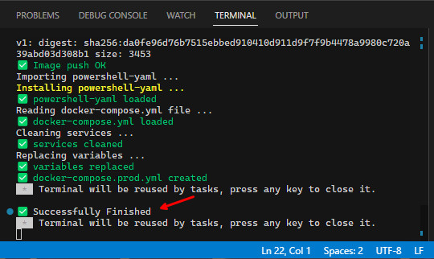

# Generate Production Image

After the project development cycle is finished, the next step is to generate a production image. The production image is the image that will be used to create a package to push to Torizon Platform OTA. The production image is generated using the `Create Production Docker Image` task. This task will generate the production image and push it to the DockerHub registry.

Inputs are needed to complete the task and are asked in the start of the task:

- `Docker namespace`: the Docker namespace to use to build the image, push it to DockerHub and set in the `docker-compose.prod.yml`. The image name will be `dockerNamespace/applicationName:dockerTag`.

----------

- `Docker tag to use in the production image`: the Docker tag to use in the production image. The image name will be `dockerNamespace/applicationName:dockerTag`.

----------

- `Docker registry password`: the Docker registry password to use to push the image to DockerHub. This will be stored as a secret in the VS Code vault.

----------

- `Container architecture`: the architecture to build the Docker image. This will be shown as itens to select. Select the architecture that matches the target device.

This is the flow of the `Create Production Docker Image` task:

- Build the application Docker image based in the `Dockerfile`;
- Push the application Docker image to the DockerHub registry;
- Generate the production `docker-compose.prod.yml` file;

Wait for the task to finish. The production Docker image will be built and pushed to DockerHub. The `docker-compose.prod.yml` file will be updated with the new image and version set by the user inputs, you should have something like the image below in the terminal tab on the finish of the task:

The generated `docker-compose.prod.yml` file is based on the `docker-compose.yml` file, the `-debug` services are removed and environment variables are set to production values. This file can be used to create a new `docker-compose` package in Torizon Platform OTA.

> ⚠️ The generated `docker-compose.prod.yml` file is not intended to be edited manually. If you need to change some rule or service in the `docker-compose.prod.yml` file, you need to edit the `docker-compose.yml` file and run the `Create Production Docker Image` task again.
