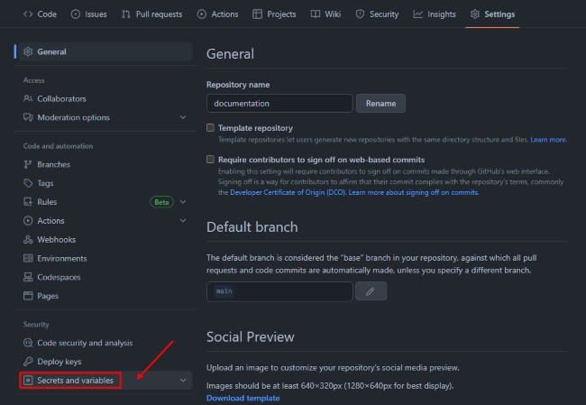
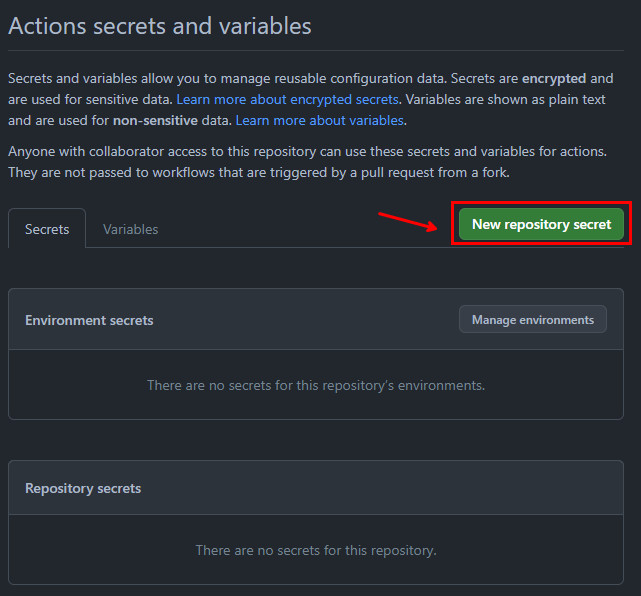
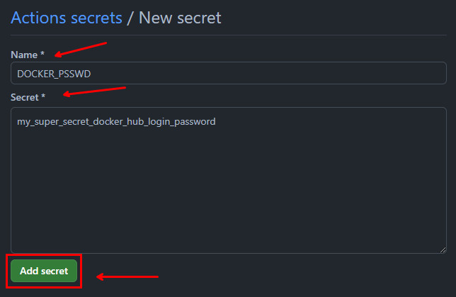
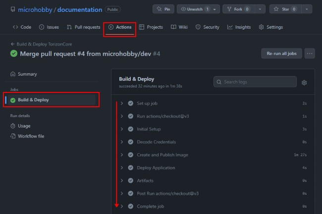

# Github Actions Integration

All the templates comes with the `.github/workflows/build-application.yaml` file configured to build and create the application package on the Torizon Platform.

## Pre-requisites

- [Github account](https://github.com/join)
- [GitHub Repository](https://docs.github.com/en/github/getting-started-with-github/create-a-repo)
- [Torizon Platform API v2 Client](./PLATFORM-API-V2-CLIENT.md)
- [Torizon Platform credentials.zip](./TORIZON-PLATFORM-CREDENTIALS.md)
- Project `fill-pipeline-settings` task executed at least once. See [Workspace Tasks](./WORKSPACE-TASKS.md#fill-pipeline-settings) for more information.

## Configure the Github Repository

After creating the Github repository, you need to configure the secrets and variables to be used in the Github Actions workflow.

In the repo page, click on the `Settings` tab:


Then, click on the `Secrets and variables` tab:



Then, click on the `Actions`:


This will load the `Actions secrets and variables` section.

### Adding Secrets

In the `Actions secrets and variables` section click on the `New repository secret`:



This will load the `New secret` section. In the `Name` field, type the name of the secret. In the `Value` field, type the value of the secret. Then, click on the `Add secret` button:



Then, you will see the secret added to the list:


Do it for all the secrets listed below:

- `DOCKER_PSSWD`: DockerHub registry login password. This is the password from the login name that comes from the `docker_login` property, from `.vscode/settings.json`, see [Workspace Settings](./WORKSPACE-SETTINGS.md#docker_login) for more information.

- `PLATFORM_CLIENT_ID`: Torizon Platform API v2 Client ID. See [Creating a New Torizon Platform API v2 Client](./PLATFORM-API-V2-CLIENT.md) for more information.

- `PLATFORM_CLIENT_SECRET`: Torizon Platform API v2 Client Secret. See [Creating a New Torizon Platform API v2 Client](./PLATFORM-API-V2-CLIENT.md) for more information.

- `PLATFORM_CREDENTIALS`: Torizon Platform credentials.zip file. See [How to get Torizon Platform credentials.zip](./TORIZON-PLATFORM-CREDENTIALS.md) for more information.

> ⚠️ The `PLATFORM_CREDENDIALS` secret must be a base64 encode of the `credentials.zip` file. To do that, run the following command in the root of the project:
>
> ```bash
> base64 -w 0 ./credentials.zip
> ```
>
> Then, copy the output and paste it in the `Secret*` field from `New secret` section. The GitHub Actions pipeline integrated in the project is already expecting a base64 encoded string, and will first decode it before use it.

## Running the Github Actions Workflow

After configuring the secrets, your Github repository is ready to run the Github Actions workflow. Simply push your changes to the repository and the workflow will be triggered automatically.

The following steps will be executed:

- `Initial Setup`: This step will verify the environment variables and secrets configured in the repository. If any of the required variables or secrets are missing, the workflow will fail fast in this first step;

- `Decode Credentials`: This step will decode the `PLATFORM_CREDENTIALS` secret into the `credentials.zip` file. This file is used by TorizonCore Builder to authenticate with the Torizon Platform;

- `Create and Publish Image`: This step will run the task `tcb-platform-publish` that depends on the `create-production-image` task. This task will create the production image and publish it to the Torizon Platform. See [Workspace Tasks](./WORKSPACE-TASKS.md#tcb-platform-publish) for more information.

- `Deploy Application`: This step will run the task `platform-update-fleet`. This task will deploy the application to the Torizon Platform fleet defined in the `tcb.fleetName` property from `.vscode/settings.json`. See [Workspace Tasks](./WORKSPACE-TASKS.md#platform-update-fleet) for more information.

> ⚠️ The `Deploy Application` step will only be executed in a `main` branch push. If you want to trigger a update when pushing in a different branch, you need to change the `if` condition in the `Deploy Application` step from the `.github/workflows/build-application.yaml` file. Check the templates repository file: <https://github.com/toradex/vscode-torizon-templates/blob/06438a9412c41f1495a9b27392cc04b1c3f989ac/assets/github/workflows/build-application.yaml#L55>

At the end of the pipeline, if all occurs as expected, you will have the following in the repo `Actions` tab:



And the Torizon Platform updated will be triggered, you should have the devices from the fleet with `Update pending` state:


